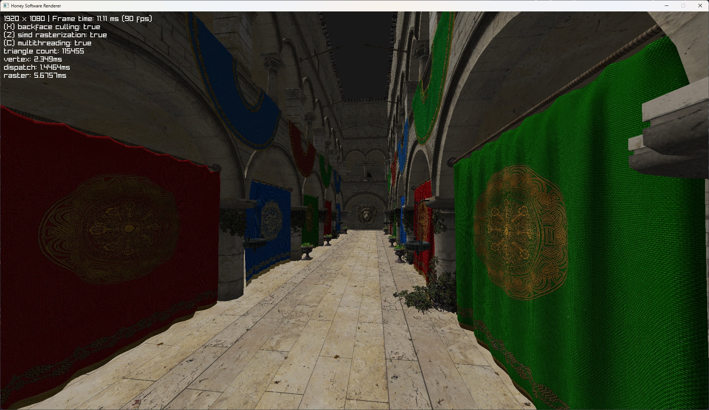

# Honey Software Renderer

A 3D software renderer implemented in Odin. It uses `vendor:raylib` to construct the window, show pixels, and handle user input. The library itself generates the pixel buffer on the cpu side. Conceivably, it should be quite easy rip out and separate the software renderer from the window input framework.

```
odin run . -o:speed -define:DEV_BUILD=true
```

**Please note**: The optimized build is quite necessary since this is a software renderer and heavy on the cpu.

## Screenshot



## Resources
- Character 3D Model is from [itch.io](https://firukono.itch.io/free-anime-maiden-3d).
- Sponza from [NCCA](https://github.com/NCCA/Sponza).